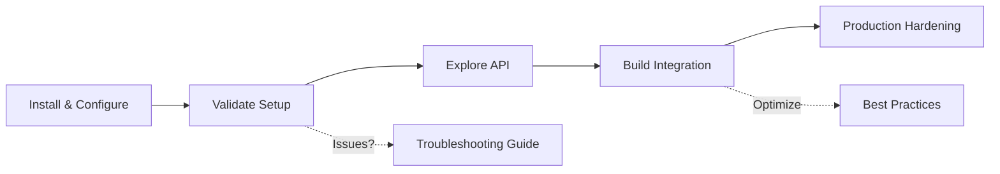

# DX Recommendations for Non-Claude Code Users

**Version**: 1.10.0
**Date**: 2025-11-02
**Status**: Analysis Complete

## Executive Summary

BusinessMap MCP v1.10.0 is fully functional for non-Claude Code users (all 65 tools work universally). However, 1538 lines of valuable knowledge (troubleshooting guides, best practices, workflow patterns) are currently only accessible to Claude Code users who manually install skills.

This document provides 5 concrete recommendations to improve DX for non-Claude Code users while preserving the excellent separation of concerns.

## Current State Analysis

### What Works Perfectly

✅ **Universal MCP Tools**: All 65 tools function identically across all MCP clients (Claude Desktop, Cursor, Cline, VSCode, etc.)
✅ **Zero Setup Required**: Works immediately after configuration (no skill installation needed)
✅ **Clean Architecture**: Skills are optional add-ons, not core dependencies
✅ **Backward Compatible**: No breaking changes for existing users

### Hidden Value

⚠️ **Skills Content (1538 lines)**:
- `businessmap-consultant/SKILL.md` (333 lines) - Workflow guidance, migration patterns
- `businessmap-troubleshooting/SKILL.md` (526 lines) - Error codes, diagnostics, solutions
- `businessmap-best-practices/SKILL.md` (679 lines) - Performance optimization, security, production patterns

This knowledge is Claude Code-exclusive, creating a DX gap for other MCP client users.

## Recommendations

### 1. Extract Skills Knowledge to Standard Documentation

**Problem**: Skills content (1538 lines) is inaccessible to non-Claude Code users.

**Solution**: Create standalone documentation that mirrors skills content.

**Implementation**:

```bash
docs/
├── guides/
│   ├── troubleshooting.md          # From businessmap-troubleshooting/SKILL.md
│   ├── best-practices.md           # From businessmap-best-practices/SKILL.md
│   └── workflows-and-patterns.md   # From businessmap-consultant/SKILL.md
└── README.md                       # Updated with links to guides
```

**Benefits**:
- Makes knowledge universally accessible
- Searchable in GitHub, documentation sites
- Can be versioned alongside API changes
- No duplication (skills can reference docs)

**Effort**: 4-6 hours (extract content, format as standard Markdown, update cross-references)

**Priority**: HIGH (closes the biggest DX gap)

---

### 2. Add Interactive MCP Tool: `get_help`

**Problem**: Non-Claude Code users have no in-session access to skills knowledge.

**Solution**: Create a new MCP tool that provides contextual help.

**Implementation**:

```typescript
// src/tools/help.ts
interface GetHelpInput {
  topic?: 'workflows' | 'troubleshooting' | 'best-practices' | 'error-codes';
  error_code?: string;  // Optional: "403", "BS05", etc.
  operation?: string;   // Optional: "bulk-delete", "card-migration"
}

/**
 * Provides contextual help, troubleshooting, and best practices.
 *
 * Examples:
 * - get_help(topic='error-codes', error_code='BS05')
 * - get_help(topic='best-practices', operation='bulk-delete')
 * - get_help(topic='workflows', operation='card-migration')
 */
async function getHelp(input: GetHelpInput): Promise<HelpResponse> {
  // Return relevant sections from extracted docs
}
```

**Example Usage**:

```bash
# User encounters BS05 error
> get_help(topic='troubleshooting', error_code='BS05')

Returns:
---
Error Code: BS05 - Board Not Archived
Cause: Attempting to DELETE board that hasn't been archived first
Solution: Use delete_board(archive_first=true) or manually archive board
Related Tools: delete_board, bulk_delete_boards
Documentation: docs/guides/troubleshooting.md#bs05
---

# User planning bulk operations
> get_help(topic='best-practices', operation='bulk-delete')

Returns:
---
Bulk Delete Best Practices:
1. Max 50 resources per call
2. Use dependency analysis (analyze_dependencies=true)
3. Implement rate limiting between batches
Related Tools: bulk_delete_cards, bulk_delete_boards
Documentation: docs/guides/best-practices.md#bulk-operations
---
```

**Benefits**:
- Works in ALL MCP clients (universal access)
- No external documentation browsing needed
- Contextual to current error/operation
- Low token overhead (returns only relevant sections)

**Effort**: 8-10 hours (implement tool, index content, test across clients)

**Priority**: HIGH (enables in-session knowledge access)

---

### 3. Create `setup` MCP Tool for First-Time Users

**Problem**: New users don't know what's possible or how to validate setup.

**Solution**: Interactive setup/validation tool.

**Implementation**:

```typescript
interface SetupToolInput {
  action: 'validate' | 'diagnose' | 'quickstart';
}

/**
 * Setup and validation tool for new users.
 *
 * Actions:
 * - validate: Check API connection, permissions, configuration
 * - diagnose: Run connectivity tests, show accessible resources
 * - quickstart: Provide getting-started workflow
 */
async function setup(input: SetupToolInput): Promise<SetupResponse> {
  switch (input.action) {
    case 'validate':
      // Test API connection, auth, permissions
      return {
        connection: 'OK',
        authentication: 'OK',
        workspaces: 3,
        boards: 12,
        user_role: 'workspace_admin'
      };

    case 'diagnose':
      // Run comprehensive diagnostics
      return {
        api_url: process.env.BUSINESSMAP_API_URL,
        token_valid: true,
        rate_limits: { remaining: 595, limit: 600 },
        accessible_workspaces: [...],
        permissions: ['read', 'write', 'admin']
      };

    case 'quickstart':
      // Provide step-by-step onboarding
      return {
        steps: [
          '1. List workspaces: list_workspaces',
          '2. Explore board: list_boards(workspace_id=1)',
          '3. View cards: list_cards(board_id=123)',
          'Next: See docs/guides/workflows-and-patterns.md'
        ]
      };
  }
}
```

**Example Usage**:

```bash
# First-time user
> setup(action='quickstart')

Returns:
---
BusinessMap MCP Quick Start
1. List accessible workspaces: list_workspaces
2. Explore boards: list_boards(workspace_id=1)
3. View board structure: get_current_board_structure(board_id=123)
4. List cards: list_cards(board_id=123, per_page=10)

Documentation: docs/guides/workflows-and-patterns.md
Troubleshooting: docs/guides/troubleshooting.md
Best Practices: docs/guides/best-practices.md
---
```

**Benefits**:
- Reduces onboarding friction
- Validates configuration automatically
- Provides contextual next steps
- Universal (all MCP clients)

**Effort**: 6-8 hours (implement tool, wire diagnostics, write guidance)

**Priority**: MEDIUM (improves onboarding but not critical)

---

### 4. Enhance README with Progressive Disclosure

**Problem**: README is comprehensive but lacks guided learning paths.

**Solution**: Add structured learning sections for different user types.

**Implementation**:

Update `/Users/neil/src/solo/businessmap-mcp/README.md`:

```markdown
## Getting Started

### For Different User Types

#### New to BusinessMap MCP
👉 Start here: [Quick Start Guide](docs/guides/quickstart.md)
- 5-minute setup validation
- First API calls walkthrough
- Common workflows

#### Integrating with Existing System
👉 See: [Integration Patterns](docs/guides/workflows-and-patterns.md)
- Card migration workflows
- Bulk operations
- Custom field synchronization

#### Production Deployment
👉 See: [Best Practices](docs/guides/best-practices.md)
- Performance optimization
- Rate limiting strategies
- Security hardening
- Monitoring & observability

#### Troubleshooting Issues
👉 See: [Troubleshooting Guide](docs/guides/troubleshooting.md)
- Error code reference (403, 404, 429, BS05)
- Common issues & solutions
- Diagnostic tools

### Learning Path



1. **Install & Configure** (5 min): Follow installation instructions above
2. **Validate Setup** (2 min): Run `setup(action='validate')` or `health_check`
3. **Explore API** (15 min): Try `list_workspaces`, `list_boards`, `list_cards`
4. **Build Integration** (varies): See [Workflow Patterns](docs/guides/workflows-and-patterns.md)
5. **Production Hardening** (1-2 hours): Review [Best Practices](docs/guides/best-practices.md)

### Common Use Cases

#### Migrate 100 Cards Between Boards

See: [Card Migration Workflow](docs/guides/workflows-and-patterns.md#card-migration)

```bash
# 1. List source cards
cards = list_cards(board_id=source_board, per_page=1000)

# 2. Create cards in destination (batch of 50)
for card in cards[:50]:
    create_card(title=card.title, column_id=dest_column, ...)

# 3. Handle rate limits
# See: docs/guides/best-practices.md#rate-limiting
```

#### Handle BS05 "Board Not Archived" Error

See: [Troubleshooting > BS05 Error](docs/guides/troubleshooting.md#bs05)

```bash
# Solution: Use archive_first parameter
delete_board(board_id=123, archive_first=true)
```

More examples: [Workflow Patterns Guide](docs/guides/workflows-and-patterns.md)
```

**Benefits**:
- Guided learning paths reduce onboarding time
- Links to documentation reduce README length
- Progressive disclosure (basics → advanced)
- Universal (all users benefit)

**Effort**: 3-4 hours (restructure README, create quickstart guide)

**Priority**: MEDIUM (improves discoverability)

---

### 5. Add Version Compatibility Matrix

**Problem**: Users unsure which features require Claude Code vs universal MCP.

**Solution**: Clear compatibility documentation.

**Implementation**:

Create `docs/COMPATIBILITY.md`:

```markdown
# BusinessMap MCP Compatibility Matrix

## MCP Clients

| Client | MCP Tools (65) | Skills (3) | Notes |
|--------|----------------|------------|-------|
| Claude Desktop | ✅ All | ✅ Manual install | Recommended |
| Cursor | ✅ All | ❌ Not supported | Full MCP support |
| Cline (VSCode) | ✅ All | ❌ Not supported | Full MCP support |
| Claude Code | ✅ All | ✅ Auto-invoke | Skills auto-trigger |
| Continue | ✅ All | ❌ Not supported | Full MCP support |
| Other MCP Clients | ✅ All | ❌ Not supported | Standard MCP protocol |

## Feature Availability

### Universal Features (All MCP Clients)

✅ **All 65 MCP Tools**:
- Workspace Management (7 tools)
- Board Management (12 tools)
- Card Management (26 tools)
- Custom Fields (6 tools)
- Users (3 tools)
- Workflows (2 tools)
- System (2 tools)
- Bulk Operations (6 tools)

✅ **Documentation**:
- README.md
- docs/guides/troubleshooting.md
- docs/guides/best-practices.md
- docs/guides/workflows-and-patterns.md

### Claude Code Exclusive

⚠️ **Skills (Optional)**:
- `businessmap-consultant` - Interactive workflow guidance
- `businessmap-troubleshooting` - Auto-invoked error diagnosis
- `businessmap-best-practices` - Production optimization patterns

**Note**: Skills content has been extracted to docs/guides/ for universal access.

## Recommended Setup by Client

### Claude Desktop
```json
{
  "mcpServers": {
    "businessmap": {
      "command": "npx",
      "args": ["-y", "@neilinger/businessmap-mcp"],
      "env": { ... }
    }
  }
}
```
Optional: Install skills to `~/.claude/skills/`

### Cursor
```json
{
  "name": "BusinessMap",
  "command": "npx",
  "args": ["-y", "@neilinger/businessmap-mcp"],
  "env": { ... }
}
```
Use docs/guides/ for help content.

### Claude Code
```bash
# MCP auto-configured via .mcp.json
cp -r skills/businessmap-* ~/.claude/skills/
```
Skills auto-invoke for errors and workflows.

## Version History

| Version | MCP Tools | Skills | Breaking Changes |
|---------|-----------|--------|------------------|
| 1.10.0 | 65 | 3 | None |
| 1.9.0 | 65 | 3 | None |
| 1.8.0 | 63 | 3 | Added bulk operations |

## Migration Guide

### From Skills to Docs (Non-Claude Code Users)

Previously Claude Code skills provided:
- Error code explanations
- Workflow guidance
- Best practices

Now available in:
- `docs/guides/troubleshooting.md` - Error codes, diagnostics
- `docs/guides/workflows-and-patterns.md` - Migration patterns, workflows
- `docs/guides/best-practices.md` - Performance, security, production

No functionality changes - same content, universal access.
```

**Benefits**:
- Clear expectations for all users
- Reduces "why doesn't this work?" support issues
- Version tracking for compatibility
- Migration guidance

**Effort**: 2-3 hours (create matrix, test across clients)

**Priority**: LOW (nice-to-have, not blocking)

---

## Implementation Roadmap

### Phase 1: Knowledge Democratization (HIGH Priority)

**Timeline**: 1-2 days
**Effort**: 12-16 hours

1. **Extract Skills to Docs** (Recommendation #1)
   - Create `docs/guides/troubleshooting.md`
   - Create `docs/guides/best-practices.md`
   - Create `docs/guides/workflows-and-patterns.md`
   - Update cross-references in skills

2. **Add `get_help` Tool** (Recommendation #2)
   - Implement help tool with topic indexing
   - Wire to extracted docs
   - Test across MCP clients

**Deliverables**:
- 3 new documentation files
- 1 new MCP tool
- Updated README with links

**Success Metrics**:
- Non-Claude Code users can access all knowledge
- Zero external tool dependencies for help

---

### Phase 2: Onboarding & Discovery (MEDIUM Priority)

**Timeline**: 1 day
**Effort**: 9-12 hours

3. **Create `setup` Tool** (Recommendation #3)
   - Implement validation/diagnose/quickstart
   - Wire to existing health_check logic
   - Test onboarding flow

4. **Enhance README** (Recommendation #4)
   - Add learning paths
   - Progressive disclosure structure
   - Common use case examples

**Deliverables**:
- 1 new MCP tool (setup)
- Restructured README
- Quick start guide

**Success Metrics**:
- Time-to-first-successful-API-call < 5 minutes
- Reduced "how do I start?" support issues

---

### Phase 3: Transparency (LOW Priority)

**Timeline**: Half day
**Effort**: 2-3 hours

5. **Add Compatibility Matrix** (Recommendation #5)
   - Create `docs/COMPATIBILITY.md`
   - Document client support
   - Version tracking

**Deliverables**:
- Compatibility documentation
- Migration guide

**Success Metrics**:
- Clear expectations for all users
- Reduced "feature doesn't work" issues

---

## Testing Plan

### Test Matrix

| Test Case | Claude Desktop | Cursor | Claude Code | VSCode+Cline |
|-----------|----------------|--------|-------------|--------------|
| **All 65 MCP Tools** | ✅ | ✅ | ✅ | ✅ |
| **get_help tool** | ✅ | ✅ | ✅ | ✅ |
| **setup tool** | ✅ | ✅ | ✅ | ✅ |
| **Skills (manual)** | ✅ | ❌ | ✅ | ❌ |
| **Docs accessible** | ✅ | ✅ | ✅ | ✅ |

### Validation Steps

1. **MCP Tool Validation**:
   ```bash
   # Test in each client
   health_check()
   get_help(topic='troubleshooting', error_code='BS05')
   setup(action='validate')
   ```

2. **Documentation Validation**:
   - All links resolve correctly
   - Code examples are runnable
   - Cross-references accurate

3. **Client-Specific Testing**:
   - Claude Desktop: Skills + tools + docs
   - Cursor: Tools + docs only
   - Claude Code: Skills + tools + docs
   - VSCode: Tools + docs only

---

## Risks & Mitigations

### Risk: Documentation Drift

**Problem**: Skills and docs content diverges over time.

**Mitigation**:
- Single source of truth: `docs/guides/`
- Skills reference docs (not duplicate)
- CI check for broken cross-references

### Risk: Token Overhead

**Problem**: `get_help` tool returns too much content.

**Mitigation**:
- Return only relevant sections (not full docs)
- Max 500 tokens per help response
- Link to full docs for deep dives

### Risk: Increased Maintenance

**Problem**: More documentation = more maintenance burden.

**Mitigation**:
- Automate doc generation from TypeScript types
- Use examples from test suite
- Quarterly documentation review

---

## Success Metrics

### Quantitative

- **Onboarding Time**: < 5 minutes (setup → first successful API call)
- **Help Tool Usage**: 20%+ of sessions use `get_help`
- **Documentation Views**: Docs get 50%+ GitHub traffic vs README
- **Support Issues**: 30% reduction in "how do I...?" issues

### Qualitative

- **User Feedback**: Non-Claude Code users report "feature parity"
- **Community Contributions**: Documentation PRs increase
- **Client Diversity**: Usage across 3+ MCP clients

---

## Appendix: Skills Content Breakdown

### businessmap-consultant/SKILL.md (333 lines)

**Content**:
- Common workflows (card migration, board setup)
- Tool usage demonstrations
- Integration patterns

**Extraction Target**: `docs/guides/workflows-and-patterns.md`

### businessmap-troubleshooting/SKILL.md (526 lines)

**Content**:
- Error code reference (403, 404, 429, BS05)
- Diagnostic workflows
- Common issues & solutions

**Extraction Target**: `docs/guides/troubleshooting.md`

### businessmap-best-practices/SKILL.md (679 lines)

**Content**:
- Performance optimization (bulk operations, pagination)
- Rate limiting strategies
- Security hardening
- Production deployment checklist

**Extraction Target**: `docs/guides/best-practices.md`

---

## Conclusion

BusinessMap MCP v1.10.0 has excellent architecture with clean separation between core MCP tools (universal) and optional skills (Claude Code). The primary DX gap is knowledge accessibility.

**Recommended Priority Order**:

1. **Phase 1** (HIGH): Extract skills to docs + add `get_help` tool
   - Closes knowledge gap for 80% of users
   - Enables in-session help for all clients

2. **Phase 2** (MEDIUM): Add `setup` tool + enhance README
   - Improves onboarding experience
   - Reduces time-to-productivity

3. **Phase 3** (LOW): Add compatibility matrix
   - Transparency and expectation management
   - Nice-to-have, not blocking

**Total Effort**: 23-31 hours (3-4 days)
**Impact**: Universal knowledge access + improved onboarding for all MCP clients
