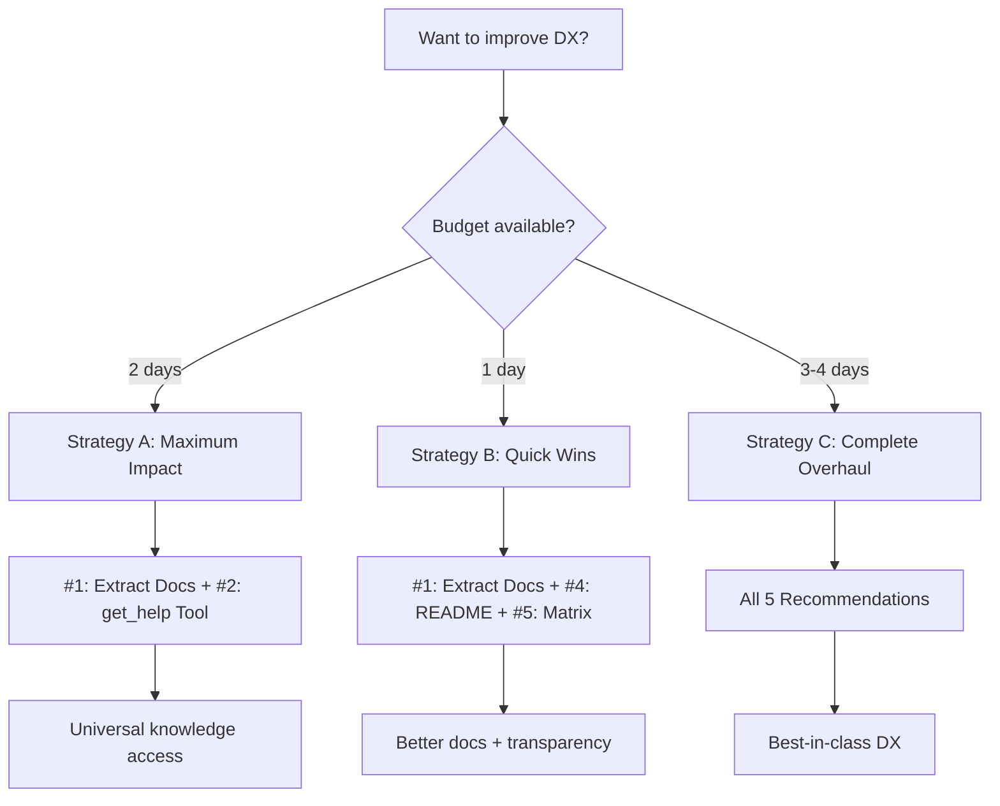

# DX Recommendations - Decision Matrix

Quick reference for prioritizing BusinessMap MCP improvements.

## Recommendations at a Glance

| #   | Recommendation        | Impact    | Effort | Priority | ROI             |
| --- | --------------------- | --------- | ------ | -------- | --------------- |
| 1   | Extract Skills → Docs | 🟢 High   | 4-6h   | HIGH     | 🟢 Excellent    |
| 2   | Add `get_help` Tool   | 🟢 High   | 8-10h  | HIGH     | 🟢 Excellent    |
| 3   | Add `setup` Tool      | 🟡 Medium | 6-8h   | MEDIUM   | 🟡 Good         |
| 4   | Enhance README        | 🟡 Medium | 3-4h   | MEDIUM   | 🟡 Good         |
| 5   | Compatibility Matrix  | 🔵 Low    | 2-3h   | LOW      | 🔵 Nice-to-have |

**Total Effort**: 23-31 hours (3-4 days)

## Decision Criteria

### By User Impact

**Closes DX Gap** (High Impact):

- #1: Extract Skills → Docs (makes 1538 lines accessible)
- #2: Add `get_help` Tool (enables in-session help)

**Improves Onboarding** (Medium Impact):

- #3: Add `setup` Tool (validates configuration)
- #4: Enhance README (guided learning)

**Increases Transparency** (Low Impact):

- #5: Compatibility Matrix (manages expectations)

### By Effort

**Quick Wins** (<5 hours):

- #5: Compatibility Matrix (2-3h)
- #4: Enhance README (3-4h)
- #1: Extract Skills → Docs (4-6h)

**Moderate Effort** (5-10 hours):

- #3: Add `setup` Tool (6-8h)
- #2: Add `get_help` Tool (8-10h)

### By ROI (Impact/Effort)

**Highest ROI**:

1. #1: Extract Skills → Docs (High impact / 4-6h)
2. #2: Add `get_help` Tool (High impact / 8-10h)

**Good ROI**: 3. #4: Enhance README (Medium impact / 3-4h) 4. #3: Add `setup` Tool (Medium impact / 6-8h)

**Nice-to-have**: 5. #5: Compatibility Matrix (Low impact / 2-3h)

## Implementation Strategies

### Strategy A: Maximum Impact (Recommended)

**Focus**: Close knowledge gap first
**Timeline**: 2 days
**Recommendations**: #1 + #2

```
Day 1: Extract Skills → Docs (4-6h)
Day 2: Implement get_help tool (8-10h)
```

**Result**: Universal knowledge access for all MCP clients

### Strategy B: Quick Wins

**Focus**: Fast improvements
**Timeline**: 1 day
**Recommendations**: #1 + #4 + #5

```
Morning: Extract Skills → Docs (4-6h)
Afternoon: Enhance README (3-4h) + Compatibility Matrix (2-3h)
```

**Result**: Better documentation, clearer expectations

### Strategy C: Complete Overhaul

**Focus**: All improvements
**Timeline**: 3-4 days
**Recommendations**: All 5

```
Phase 1 (Days 1-2): #1 + #2 (Knowledge democratization)
Phase 2 (Day 3): #3 + #4 (Onboarding)
Phase 3 (Day 4): #5 (Transparency)
```

**Result**: Best-in-class DX for all MCP clients

## Decision Tree



## Recommendation-Specific Details

### #1: Extract Skills → Docs

**Files Created**:

- `docs/guides/troubleshooting.md` (from businessmap-troubleshooting/SKILL.md)
- `docs/guides/best-practices.md` (from businessmap-best-practices/SKILL.md)
- `docs/guides/workflows-and-patterns.md` (from businessmap-consultant/SKILL.md)

**Changes**:

- Update README with links
- Update skills to reference docs (avoid duplication)

**Testing**:

- All links resolve
- Code examples runnable
- Cross-references accurate

### #2: Add `get_help` Tool

**Implementation**:

```typescript
interface GetHelpInput {
  topic?: 'workflows' | 'troubleshooting' | 'best-practices' | 'error-codes';
  error_code?: string;
  operation?: string;
}
```

**Testing**:

- Claude Desktop: ✅
- Cursor: ✅
- Claude Code: ✅
- VSCode+Cline: ✅

**Token Budget**: <500 tokens per response

### #3: Add `setup` Tool

**Implementation**:

```typescript
interface SetupToolInput {
  action: 'validate' | 'diagnose' | 'quickstart';
}
```

**Testing**:

- Connection validation works
- Diagnostics return accurate info
- Quickstart provides actionable steps

**Success Metric**: Time-to-first-API-call < 5 minutes

### #4: Enhance README

**Changes**:

- Add learning paths section
- Progressive disclosure structure
- Common use case examples
- Links to new guides

**Testing**:

- README length reasonable (<700 lines)
- Links to guides work
- Examples copy-pasteable

### #5: Compatibility Matrix

**File**: `docs/COMPATIBILITY.md`

**Content**:

- Client support table
- Feature availability
- Version history
- Migration guide

**Testing**:

- Matrix accurate for all clients
- Version history complete

## Post-Implementation Checklist

After implementing recommendations:

- [ ] All documentation links resolve
- [ ] Code examples tested across clients
- [ ] README updated with new guides
- [ ] Skills reference docs (no duplication)
- [ ] CI checks for broken links
- [ ] GitHub Pages updated (if applicable)
- [ ] CHANGELOG.md updated
- [ ] Version bumped (minor: 1.10.0 → 1.11.0)
- [ ] NPM published
- [ ] GitHub release created
- [ ] Community announcement (if applicable)

## Questions to Consider

Before implementing:

1. **Which MCP clients do your users primarily use?**
   - If mostly Claude Code: Maybe #1 only
   - If diverse clients: #1 + #2 critical

2. **What's your support burden?**
   - High "how do I...?" issues: Prioritize #3 + #4
   - High error-related issues: Prioritize #1 + #2

3. **How often do you release?**
   - Frequent releases: Implement incrementally
   - Infrequent releases: Bundle all 5

4. **What's your documentation strategy?**
   - Docs-first: #1 + #4 + #5
   - Tool-first: #2 + #3

## Conclusion

**Recommended Starting Point**: Strategy A (Maximum Impact)

- Implement #1 + #2 in 2 days
- Closes knowledge gap for all users
- Enables in-session help universally

**Then Evaluate**: Based on user feedback, consider #3-#5 in future releases.

---

**Related Documents**:

- [Full Analysis](/Users/neil/src/solo/businessmap-mcp/docs/DX_RECOMMENDATIONS_NON_CLAUDE_CODE.md)
- [Executive Summary](/Users/neil/src/solo/businessmap-mcp/DX_SUMMARY.md)
