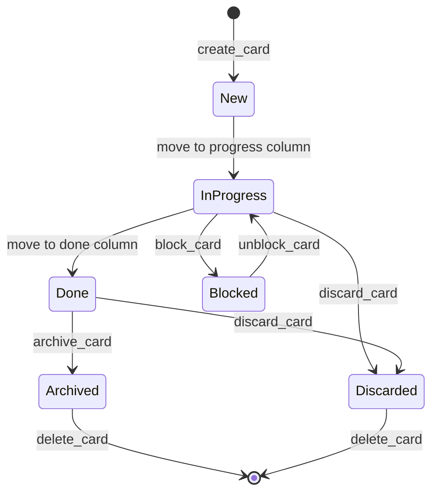

# Data Model: Complete CRUD Operations

**Feature**: 001-complete-crud-operations
**Date**: 2025-10-24
**Source**: Feature specification + BusinessMap API v2 schema

---

## Entity Relationship Diagram

```text
Workspace (1:N) Board
                 │
                 ├── (1:N) Workflow
                 │         ├── (1:N) Column
                 │         └── (1:N) Lane
                 │
                 ├── (1:N) CustomField
                 │
                 └── (1:N) Card
                           ├── (N:1 required) → Column  [FK: column_id]
                           ├── (N:1 optional) → Lane    [FK: lane_id]
                           ├── (1:N) Comment
                           ├── (1:N) Subtask
                           ├── (1:N) Outcome (read-only)
                           ├── (N:N) CustomFieldValue → CustomField
                           └── (N:N) ParentCard / ChildCard (self-join)
```

**Key Corrections from Original ERD**:
- ✅ Added Card→Column relationship (required FK: column_id)
- ✅ Added Card→Lane relationship (optional FK: lane_id)
- ✅ Corrected Workflow/Column/Lane hierarchy under Board
- ✅ Clarified CustomFieldValue as N:N junction table
- ✅ Showed Card's 3D positioning: Board (scope) × Column (horizontal) × Lane (vertical)

**CustomField Design Pattern** (Definition vs Instance):
- **CustomField**: Board-level field *definition* (schema/metadata)
  - Defines field name, type, constraints, options
  - Managed via `/boards/{board_id}/customFields` endpoints
  - Full CRUD support (GET, POST, PATCH, DELETE)
- **CustomFieldValue**: Card-level field *value* (actual data)
  - Stores actual field value for specific card
  - Composite key: (card_id, field_id)
  - Managed via card update operations (no separate endpoints)
- **Pattern**: One field definition can be applied to many cards, each with its own value

---

## Core Entities

### Workspace

**Purpose**: Top-level container for boards and organizational settings

**Fields**:
| Field | Type | Required | Constraints | Description |
|-------|------|----------|-------------|-------------|
| `workspace_id` | number | Yes | Unique, auto-generated | Primary identifier |
| `name` | string | Yes | 1-255 chars | Workspace name |
| `description` | string | No | 0-2000 chars | Workspace description |
| `created_at` | datetime | Yes | ISO 8601 | Creation timestamp |
| `updated_at` | datetime | Yes | ISO 8601 | Last modification timestamp |

**Relationships**:
- Has many: `Board` (1:N)
- Cascade delete: Deleting workspace deletes all contained boards and their cards

**State Transitions**: None (simple CRUD)

**Validation Rules**:
- `name` must be unique within organization
- Deletion requires confirmation if contains boards

**CRUD Operations**:
- ✅ Create: Existing
- ✅ Read: Existing
- ✅ Update: **Phase 2** (expose existing client method)
- ✅ Delete: **Phase 2** (expose existing client method, cascade confirmation)

---

### Board

**Purpose**: Kanban board containing cards, workflows, columns, and lanes

**Fields**:
| Field | Type | Required | Constraints | Description |
|-------|------|----------|-------------|-------------|
| `board_id` | number | Yes | Unique, auto-generated | Primary identifier |
| `workspace_id` | number | Yes | Foreign key | Parent workspace |
| `name` | string | Yes | 1-255 chars | Board name |
| `description` | string | No | 0-2000 chars | Board description |
| `is_archived` | boolean | Yes | Default: false | Archive status |
| `project_id` | number | No | - | Optional project association |
| `revision` | number | Yes | Auto-increment | Optimistic locking version |
| `created_at` | datetime | Yes | ISO 8601 | Creation timestamp |
| `updated_at` | datetime | Yes | ISO 8601 | Last modification timestamp |

**Relationships**:
- Belongs to: `Workspace` (N:1)
- Has many: `Card`, `Workflow`, `Lane`, `CustomField` (1:N each)
- Cascade delete: Deleting board deletes all cards, workflows, lanes

**State Transitions**:
```
[Active] <──> [Archived]
   ↓
[Deleted] (cascade to cards)
```

**Validation Rules**:
- `name` must be unique within workspace
- Cannot delete board with active cards without confirmation
- Archive before delete (optional workflow)

**CRUD Operations**:
- ✅ Create: Existing
- ✅ Read: Existing
- ✅ Update: **Phase 2** (expose existing client method)
- ✅ Delete: **Phase 2** (expose existing client method, cascade confirmation)

---

### Card

**Purpose**: Primary work item representing tasks, issues, or features

**Fields**:
| Field | Type | Required | Constraints | Description |
|-------|------|----------|-------------|-------------|
| `card_id` | number | Yes | Unique, auto-generated | Primary identifier |
| `board_id` | number | Yes | Foreign key | Parent board |
| `column_id` | number | Yes | Foreign key | Current column location |
| `lane_id` | number | No | Foreign key | Current lane (swimlane) |
| `title` | string | Yes | 1-500 chars | Card title |
| `description` | string | No | 0-10000 chars | Card description (markdown) |
| `custom_id` | string | No | Unique within board | User-defined ID |
| `owner_user_id` | number | No | Foreign key | Card owner |
| `reporter_user_id` | number | No | Foreign key | Card reporter |
| `priority` | number | No | 0-4 | Priority level (0=none, 1=low, 2=normal, 3=high, 4=critical) |
| `size` | number | No | ≥0 | Story points or size estimate |
| `color` | string | No | Hex color | Visual indicator |
| `position` | number | Yes | ≥0 | Position within column |
| `deadline` | date | No | ISO 8601 date | Due date |
| `is_archived` | boolean | Yes | Default: false | Archive status |
| `is_discarded` | boolean | Yes | Default: false | Discard status |
| `type_id` | number | No | Foreign key | Card type |
| `created_at` | datetime | Yes | ISO 8601 | Creation timestamp |
| `updated_at` | datetime | Yes | ISO 8601 | Last modification timestamp |

**Relationships**:
- Belongs to: `Board`, `Column` (N:1 each)
- Optionally belongs to: `Lane` (N:1)
- Has many: `Comment`, `Subtask`, `Outcome`, `CustomFieldValue`, `ChildCard` (1:N each)
- Has many: `ParentCard` (N:N through parent-child relationship)
- Cascade delete: Deleting card deletes all comments, subtasks, children

**State Transitions**:
```
[New] → [In Progress] → [Done] → [Archived]
                         ↓
                    [Discarded]
```

**Validation Rules**:
- `title` required, non-empty
- `column_id` must exist on same board
- `lane_id` must exist on same board (if specified)
- Cannot move to column at WIP limit
- Deletion with children requires confirmation

**CRUD Operations**:
- ✅ Create: Existing
- ✅ Read: Existing
- ✅ Update: Existing (including move between columns/lanes)
- ✅ Delete: **Phase 2** (expose existing client method, cascade confirmation)

---

### Comment

**Purpose**: Text annotation on a card for collaboration and discussion

**Fields**:
| Field | Type | Required | Constraints | Description |
|-------|------|----------|-------------|-------------|
| `comment_id` | number | Yes | Unique, auto-generated | Primary identifier |
| `card_id` | number | Yes | Foreign key | Parent card |
| `author_user_id` | number | Yes | Foreign key | Comment author |
| `text` | string | Yes | 1-10000 chars | Comment content (markdown) |
| `mentions` | array | No | User IDs | @-mentioned users |
| `created_at` | datetime | Yes | ISO 8601 | Creation timestamp |
| `updated_at` | datetime | Yes | ISO 8601 | Last modification timestamp |

**Relationships**:
- Belongs to: `Card` (N:1)
- References: `User` (author, mentions) (N:N)

**State Transitions**: None (simple CRUD)

**Validation Rules**:
- `text` required, non-empty
- `author_user_id` must be authenticated user (for create)
- Only author or admins can update/delete

**CRUD Operations**:
- ✅ Create: Existing
- ✅ Read: Existing
- ✅ Update: **Phase 1** (implement new - verified available)
- ✅ Delete: **Phase 1** (implement new - verified available)

---

### Subtask

**Purpose**: Checklist item or sub-work unit within a card

**Fields**:
| Field | Type | Required | Constraints | Description |
|-------|------|----------|-------------|-------------|
| `subtask_id` | number | Yes | Unique, auto-generated | Primary identifier |
| `card_id` | number | Yes | Foreign key | Parent card |
| `description` | string | Yes | 1-500 chars | Subtask description |
| `owner_user_id` | number | No | Foreign key | Subtask owner |
| `is_finished` | boolean | Yes | Default: false | Completion status |
| `deadline` | date | No | ISO 8601 date | Due date |
| `position` | number | Yes | ≥0 | Display order |
| `created_at` | datetime | Yes | ISO 8601 | Creation timestamp |
| `updated_at` | datetime | Yes | ISO 8601 | Last modification timestamp |

**Relationships**:
- Belongs to: `Card` (N:1)
- Optionally assigned to: `User` (N:1)

**State Transitions**:
```
[Pending] <──> [Finished]
```

**Validation Rules**:
- `description` required, non-empty
- `position` must be unique within card
- Completion timestamp tracked via `updated_at` when `is_finished` changes

**CRUD Operations**:
- ✅ Create: Existing
- ✅ Read: Existing
- ✅ Update: **Phase 1** (implement new - verified available)
- ✅ Delete: **Phase 1** (implement new - verified available)

---

### Outcome (Read-Only)

**Purpose**: Resolution record for completed or discarded cards

**Fields**:
| Field | Type | Required | Constraints | Description |
|-------|------|----------|-------------|-------------|
| `outcome_id` | number | Yes | Unique, auto-generated | Primary identifier |
| `card_id` | number | Yes | Foreign key | Parent card |
| `resolution_type` | string | Yes | Enum | Type of resolution (completed, discarded, etc.) |
| `resolution_details` | string | No | 0-2000 chars | Resolution notes |
| `closed_by_user_id` | number | Yes | Foreign key | User who closed card |
| `closed_at` | datetime | Yes | ISO 8601 | Closure timestamp |

**Relationships**:
- Belongs to: `Card` (N:1)
- References: `User` (closed_by) (N:1)

**State Transitions**: None (immutable once created)

**Validation Rules**:
- Read-only via API (created automatically by BusinessMap when cards are closed)
- Cannot create, update, or delete via API

**CRUD Operations**:
- ❌ Create: Not supported (auto-generated)
- ✅ Read: Existing
- ❌ Update: Not supported (immutable)
- ❌ Delete: Not supported (immutable)

---

### Lane (Swimlane)

**Purpose**: Horizontal grouping of cards within a board (by team, priority, type)

**Fields**:
| Field | Type | Required | Constraints | Description |
|-------|------|----------|-------------|-------------|
| `lane_id` | number | Yes | Unique, auto-generated | Primary identifier |
| `board_id` | number | Yes | Foreign key | Parent board |
| `workflow_id` | number | Yes | Foreign key | Parent workflow |
| `name` | string | Yes | 1-255 chars | Lane name |
| `description` | string | No | 0-2000 chars | Lane description |
| `color` | string | Yes | Hex color | Visual indicator |
| `position` | number | Yes | ≥0 | Display order |

**Relationships**:
- Belongs to: `Board`, `Workflow` (N:1 each)
- Has many: `Card` (1:N)

**State Transitions**: None (simple CRUD for definitions)

**Validation Rules**:
- `name` must be unique within board
- `position` must be unique within workflow
- Cannot delete lane containing cards

**CRUD Operations**:
- ✅ Create: Existing
- ✅ Read: Existing
- ❌ Update: Not supported (API limitation)
- ❌ Delete: Not supported (API limitation)

**Note**: Moving cards between lanes is supported via card update operations. This entity represents lane **definitions** only.

---

### Workflow (Read-Only)

**Purpose**: Process definition containing ordered columns representing work stages

**Fields**:
| Field | Type | Required | Constraints | Description |
|-------|------|----------|-------------|-------------|
| `workflow_id` | number | Yes | Unique, auto-generated | Primary identifier |
| `board_id` | number | Yes | Foreign key | Parent board |
| `name` | string | Yes | 1-255 chars | Workflow name |
| `is_enabled` | boolean | Yes | Default: true | Active status |

**Relationships**:
- Belongs to: `Board` (N:1)
- Has many: `Column`, `Lane` (1:N each)

**State Transitions**: None (UI-only operations)

**Validation Rules**:
- Read-only via API
- Cannot create, update, or delete workflows via API

**CRUD Operations**:
- ❌ Create: Not supported (UI-only)
- ✅ Read: Existing (limited to cycle time columns)
- ❌ Update: Not supported (UI-only)
- ❌ Delete: Not supported (UI-only)

---

### Column (Read-Only)

**Purpose**: Stage within a workflow representing a step in the process

**Fields**:
| Field | Type | Required | Constraints | Description |
|-------|------|----------|-------------|-------------|
| `column_id` | number | Yes | Unique, auto-generated | Primary identifier |
| `workflow_id` | number | Yes | Foreign key | Parent workflow |
| `name` | string | Yes | 1-255 chars | Column name |
| `position` | number | Yes | ≥0 | Display order in workflow |
| `wip_limit` | number | No | ≥0 | Work-in-progress limit |
| `is_start_column` | boolean | Yes | Default: false | Entry point flag |
| `is_end_column` | boolean | Yes | Default: false | Completion point flag |

**Relationships**:
- Belongs to: `Workflow` (N:1)
- Has many: `Card` (1:N)

**State Transitions**: None (UI-only operations)

**Validation Rules**:
- Read-only via API (create/update not supported)
- Delete endpoint uncertain (requires testing)
- WIP limit enforced by BusinessMap when moving cards

**CRUD Operations**:
- ❌ Create: Not supported (UI-only)
- ✅ Read: Existing
- ❌ Update: Not supported (UI-only)
- ❓ Delete: Requires testing (conflicting documentation)

---

### CustomField (Definition)

**Purpose**: User-defined data field schema with type, options, and constraints

**Fields**:
| Field | Type | Required | Constraints | Description |
|-------|------|----------|-------------|-------------|
| `field_id` | number | Yes | Unique, auto-generated | Primary identifier |
| `board_id` | number | Yes | Foreign key | Parent board |
| `name` | string | Yes | 1-255 chars | Field name |
| `label` | string | Yes | 1-255 chars | Display label |
| `field_type` | string | Yes | Enum | Data type (text, number, date, dropdown, etc.) |
| `is_required` | boolean | Yes | Default: false | Mandatory flag |
| `options` | array | No | Type-dependent | Allowed values (for dropdown, multi-select) |
| `default_value` | any | No | Type-dependent | Default value for new cards |
| `position` | number | Yes | ≥0 | Display order |
| `is_visible` | boolean | Yes | Default: true | Visibility flag |

**Relationships**:
- Belongs to: `Board` (N:1)
- Applied to: `Card` via `CustomFieldValue` (1:N)

**State Transitions**: None (simple CRUD)

**Validation Rules**:
- `name` must be unique within board
- `field_type` must be valid enum value
- `options` required for dropdown/multi-select types
- Cannot delete field with existing values (or cascade delete values)

**CRUD Operations**:
- ✅ Create: **Phase 1** (implement new - verified available, no admin restrictions)
- ✅ Read: **Phase 1** (implement new - verified available)
- ✅ Update: **Phase 1** (implement new - verified available)
- ✅ Delete: **Phase 1** (implement new - verified available)

---

### CustomFieldValue

**Purpose**: Actual custom field value on a specific card

**Fields**:
| Field | Type | Required | Constraints | Description |
|-------|------|----------|-------------|-------------|
| `card_id` | number | Yes | Composite key | Parent card |
| `field_id` | number | Yes | Composite key | Field definition |
| `value` | any | No | Type-dependent | Field value (typed based on field definition) |
| `updated_at` | datetime | Yes | ISO 8601 | Last modification timestamp |

**Relationships**:
- Belongs to: `Card`, `CustomField` (N:1 each)

**State Transitions**: None (simple CRUD)

**Validation Rules**:
- `value` must match `field_type` constraints
- `value` must be in `options` if field is dropdown/multi-select
- Required fields must have non-null values

**CRUD Operations**:
- ✅ Create/Update/Delete: Existing (via card update operations)
- ✅ Read: Existing (via card read operations)

**Note**: Custom field **values** are managed via card CRUD operations, not separate endpoints.

---

## Operation Categories

### Phase 1: New Operations (10 total)

**Comments**:
1. `update_card_comment` - Update comment text, mentions
2. `delete_card_comment` - Remove comment from card

**Subtasks**:
3. `update_card_subtask` - Update description, owner, deadline, completion status
4. `delete_card_subtask` - Remove subtask from card

**Custom Fields**:
5. `list_custom_fields` - Get all custom field definitions across workspace
6. `list_board_custom_fields` - Get custom field definitions for specific board
7. `get_custom_field` - Get single custom field definition details
8. `create_custom_field` - Create new custom field definition
9. `update_custom_field` - Update field schema, options, constraints
10. `delete_custom_field` - Remove custom field definition (cascade to values)

---

### Phase 2: Quick Wins (5 total)

**Workspace**:
1. `update_workspace` - Update name, description
2. `delete_workspace` - Remove workspace (cascade confirmation)

**Board**:
3. `update_board` - Update name, description, archive status
4. `delete_board` - Remove board (cascade confirmation)

**Card**:
5. `delete_card` - Remove card (cascade confirmation)

---

## Validation Matrix

| Entity | Required Fields | Unique Fields | Cascade Delete | Confirmation Required |
|--------|----------------|---------------|----------------|----------------------|
| Workspace | name | workspace_id, name (org-scoped) | → Boards → Cards | Yes (if has boards) |
| Board | name, workspace_id | board_id, name (workspace-scoped) | → Cards, Workflows, Lanes | Yes (if has cards) |
| Card | title, column_id, board_id | card_id, custom_id (board-scoped) | → Comments, Subtasks, Children | Yes (if has children) |
| Comment | text, card_id, author_user_id | comment_id | None | No |
| Subtask | description, card_id | subtask_id, position (card-scoped) | None | No |
| Lane | name, workflow_id, position, color | lane_id, name (board-scoped), position (workflow-scoped) | None | Yes (if has cards) |
| CustomField | name, label, field_type, board_id | field_id, name (board-scoped) | → CustomFieldValue | Unclear (may auto-cascade) |

---

## Indexing Recommendations

Based on query patterns and relationships:

```sql
-- Primary lookups
CREATE INDEX idx_board_workspace ON boards(workspace_id);
CREATE INDEX idx_card_board ON cards(board_id);
CREATE INDEX idx_card_column ON cards(column_id);
CREATE INDEX idx_card_lane ON cards(lane_id);

-- Comment/Subtask retrieval
CREATE INDEX idx_comment_card ON comments(card_id);
CREATE INDEX idx_subtask_card ON subtasks(card_id);

-- Custom field lookups
CREATE INDEX idx_customfield_board ON custom_fields(board_id);
CREATE INDEX idx_customfieldvalue_card ON custom_field_values(card_id);
CREATE INDEX idx_customfieldvalue_field ON custom_field_values(field_id);

-- Parent-child relationships
CREATE INDEX idx_card_parent ON card_parents(parent_card_id);
CREATE INDEX idx_card_child ON card_parents(child_card_id);

-- Audit trails
CREATE INDEX idx_card_updated ON cards(updated_at);
CREATE INDEX idx_comment_created ON comments(created_at);
```

**Note**: BusinessMap manages indexes internally; these are advisory for understanding query performance.

---

## Data Flow Patterns

### Card Creation with Full Context
```
1. Create Card → returns card_id
2. Add Comments (parallel) → comment_ids
3. Add Subtasks (parallel) → subtask_ids
4. Set CustomFieldValues (via card update) → updated card
5. Link Parents/Children (parallel) → relationships
```

### Cascade Delete Flow
```
Delete Workspace
  ↓
List contained Boards → present confirmation
  ↓
User confirms
  ↓
For each Board:
  → Delete all Cards
    → Delete all Comments
    → Delete all Subtasks
    → Delete all CustomFieldValues
  → Delete all Workflows
  → Delete all Lanes
  → Delete Board
  ↓
Delete Workspace
```

### Custom Field Definition Update
```
Update CustomField definition (type, options)
  ↓
BusinessMap validates existing CustomFieldValues
  ↓
If incompatible (e.g., text→number with non-numeric data):
  → Block update with error
  → Suggest remediation (clear values or fix data)
Else:
  → Apply update
  → Migrate values if needed (e.g., dropdown option rename)
```

---

## State Machine: Card Lifecycle



---

## Error Handling: Data Integrity

| Scenario | Error Code | Message | Remediation |
|----------|-----------|---------|-------------|
| Delete workspace with boards | `DEP01` | "Workspace contains N boards" | Confirm cascade or delete boards first |
| Delete card with children | `DEP02` | "Card has N child cards" | Confirm cascade or unlink children |
| Move card to column at WIP limit | `WIP01` | "Column WIP limit (X) reached" | Move another card out or increase limit |
| Update custom field with incompatible data | `VAL01` | "Cannot convert existing values to new type" | Clear values or fix data first |
| Delete lane with cards | `DEP03` | "Lane contains N cards" | Move cards to another lane first |
| Create comment as another user | `AUTH01` | "Cannot create comment for another user" | Use authenticated user ID |

---

## Performance Considerations

### Read Operations
- Board structure queries (workflows, columns, lanes): Cacheable (rarely change)
- Card lists: Paginated (max 1000 per request)
- Comment/Subtask retrieval: N+1 potential (fetch per card)

### Write Operations
- Bulk card updates: Sequential with rate limit throttling
- Cascade deletes: Single transaction (BusinessMap handles atomicity)
- Custom field updates: Validate existing values before applying

### Rate Limit Impact
- Default: 30 requests/minute, 600 requests/hour
- Bulk operations: Queue with 2-second spacing (~25/min with safety margin)
- Read-heavy workflows: Lower impact (most reads should be cached)

---

## Data Model Version

**Version**: 1.0.0
**Last Updated**: 2025-10-24
**Next Review**: After Phase 1 implementation (integration test findings may reveal model adjustments)

---

## References

1. **Feature Specification**: `/specs/001-complete-crud-operations/spec.md`
2. **Research Findings**: `/specs/001-complete-crud-operations/research.md`
3. **BusinessMap API v2** (Official API Source):
   - Interactive Docs: https://demo.kanbanize.com/openapi
   - JSON Schema: https://demo.kanbanize.com/openapi/json
4. **Existing Client Code**: `src/clients/*-client.ts` (current implementations)
