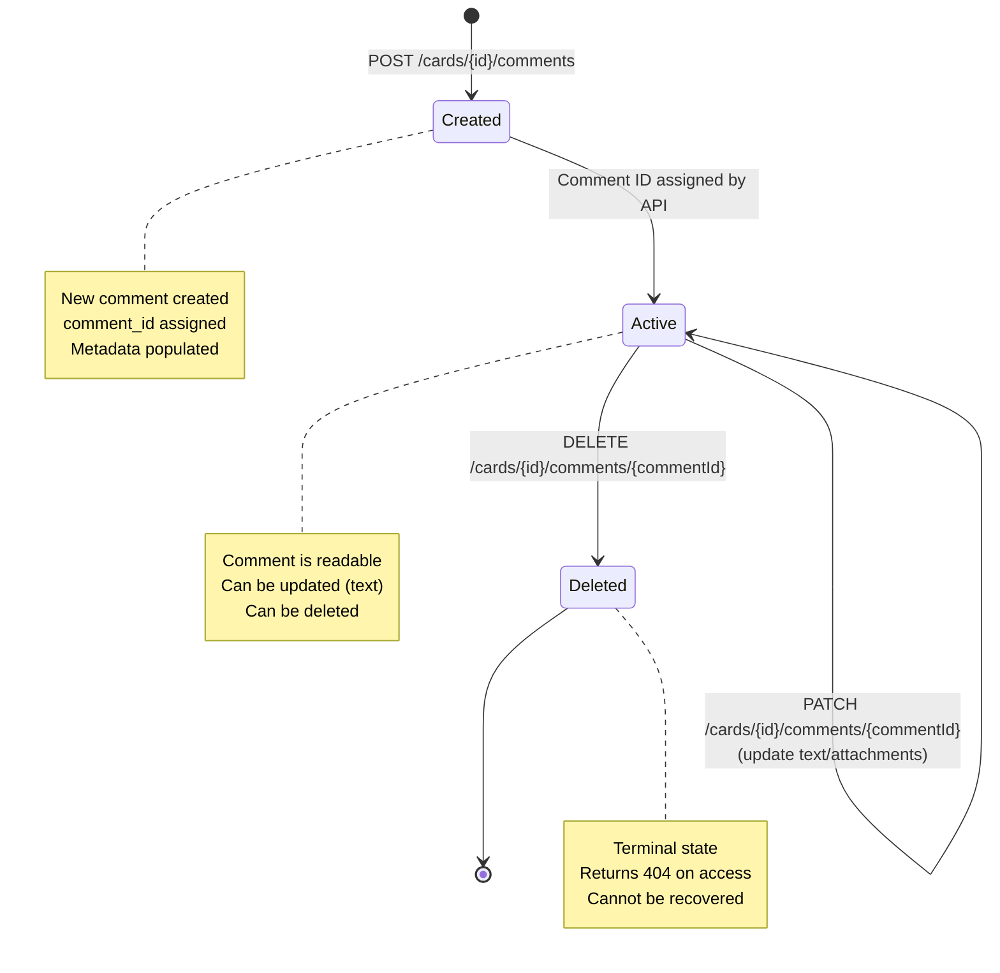
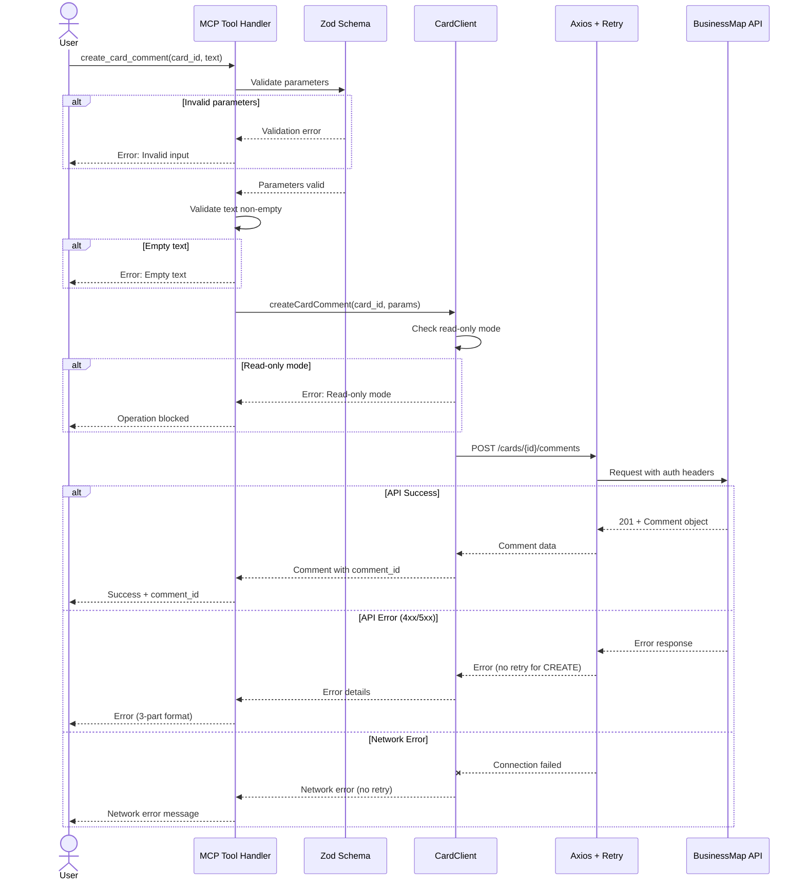
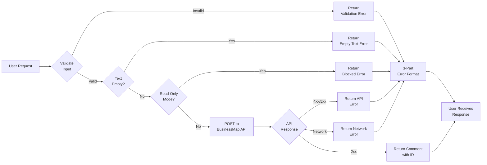

# Data Model: Card Comments CRUD

## Entity: Card Comment

### Description
A text-based annotation attached to a BusinessMap card. Comments enable users to add contextual information, document updates, and communicate about card progress without modifying the card's core data.

### Attributes

| Attribute | Type | Source | Description | Validation |
|-----------|------|--------|-------------|------------|
| `comment_id` | number | API | Unique identifier for the comment | Read-only, assigned by API |
| `card_id` | number | Client | Reference to parent card | Required for all operations |
| `type` | string | API | Comment type classification | Read-only, set by API |
| `text` | string | Client | Comment content | Required, non-empty, no whitespace-only |
| `attachments` | **array of objects** | API | File attachments metadata (read-only in responses) | Cannot be modified directly |
| `attachments[].id` | number | API | Attachment unique identifier | Read-only |
| `attachments[].file_name` | string | API | Original filename | Read-only |
| `attachments[].link` | string | API | URL to attachment | Read-only |
| `created_at` | string (ISO 8601) | API | Comment creation timestamp | Read-only, set by API |
| `last_modified` | string (ISO 8601) | API | Last update timestamp | Read-only, updated by API |
| `author` | object | API | Comment author metadata | Read-only |
| `author.type` | string | API | Author type (e.g., "user") | Read-only |
| `author.value` | number | API | Author user ID | Read-only |

**Note on Attachments**:
- **Response field**: `attachments` (array, read-only) - view existing attachments
- **Input parameter**: `attachments_to_add` (array, write-only) - add new attachments when creating/updating
- Attachments are **additive only** - cannot be removed via API once added
- **API Verification Pending**: Attachment support in CREATE/UPDATE not yet confirmed (requires testing)

### Relationships

```text
Card (1) ─────< has many >───── (N) Comment
  │                                  │
  │                                  └─< has >─── (0..N) Attachment
  └─< has >─── (1) Board
```

- A Card can have zero or many Comments
- A Comment belongs to exactly one Card
- A Comment has an Author (User)
- A Comment may have zero or many Attachments

### State Lifecycle



**State Descriptions:**
- **Created**: New comment added via POST, comment_id assigned
- **Active**: Comment exists and is readable
- **Updated**: Text or attachments modified via PATCH
- **Deleted**: Comment removed, returns 404 on subsequent requests

### Invariants

1. **Immutable Identity**: `comment_id` never changes once assigned
2. **Card Association**: A comment's `card_id` cannot be changed after creation
3. **Author Preservation**: `author` metadata is immutable (set on creation)
4. **Non-Empty Text**: `text` field cannot be empty or whitespace-only
5. **Timestamp Ordering**: `last_modified` >= `created_at`
6. **Deletion Finality**: Deleted comments cannot be recovered via API

## Input Parameters

### CreateCommentParams

**Used for**: Creating new comments via `POST /cards/{cardId}/comments`

```typescript
export interface CreateCommentParams {
  text: string;                   // Required: Comment content
  attachments_to_add?: Array<{    // Optional: File attachments
    file_name: string;
    link: string;
  }>;
}
```

**Validation Rules:**
- `text`: Required, non-empty after trimming whitespace
- `text`: Cannot be whitespace-only (e.g., "   ")
- `attachments_to_add`: Optional, each attachment requires both `file_name` and `link`

**Example:**
```json
{
  "text": "Updated requirements based on stakeholder feedback",
  "attachments_to_add": [
    {
      "file_name": "requirements-v2.pdf",
      "link": "https://example.com/docs/requirements-v2.pdf"
    }
  ]
}
```

### UpdateCommentParams

**Used for**: Updating existing comments via `PATCH /cards/{cardId}/comments/{commentId}`

**⚠️ CRITICAL LIMITATIONS**:
1. **Attachments are additive only** - Cannot remove attachments once added to a comment
2. **No attachment replacement** - Must delete entire comment and recreate to change attachments
3. **Endpoint unverified** - UPDATE operation requires integration test verification before implementation
4. **API Verification Pending**: Attachment support in UPDATE not yet confirmed

```typescript
export interface UpdateCommentParams {
  text?: string;                  // Optional: New comment content
  attachments_to_add?: Array<{    // Optional: Additional attachments
    file_name: string;
    link: string;
  }>;
}
```

**Validation Rules:**
- At least one field must be provided
- If `text` provided: non-empty after trimming whitespace
- If `text` provided: cannot be whitespace-only
- Attachments are additive (no removal supported)

**Example:**
```json
{
  "text": "Revised: Updated requirements based on final stakeholder feedback"
}
```

### DeleteCommentParams

**Used for**: Deleting comments via `DELETE /cards/{cardId}/comments/{commentId}`

No request body required. Parameters passed in URL path:
- `card_id` (number): Parent card identifier
- `comment_id` (number): Comment to delete

## Response Formats

### CommentResponse

**Used for**: Single comment operations (GET, POST, PATCH)

```typescript
export interface CommentResponse {
  data: Comment;
}
```

**Example:**
```json
{
  "data": {
    "comment_id": 12345,
    "type": "comment",
    "text": "Updated requirements based on stakeholder feedback",
    "attachments": {
      "id": 67890,
      "file_name": "requirements-v2.pdf",
      "link": "https://example.com/docs/requirements-v2.pdf"
    },
    "created_at": "2025-11-20T10:30:00Z",
    "last_modified": "2025-11-20T10:30:00Z",
    "author": {
      "type": "user",
      "value": 42
    }
  }
}
```

### CommentListResponse

**Used for**: Listing all comments (GET /cards/{cardId}/comments)

```typescript
export interface CommentListResponse {
  data: Comment[];
}
```

**Example:**
```json
{
  "data": [
    {
      "comment_id": 12345,
      "type": "comment",
      "text": "First comment",
      "attachments": {},
      "created_at": "2025-11-20T10:30:00Z",
      "last_modified": "2025-11-20T10:30:00Z",
      "author": {"type": "user", "value": 42}
    },
    {
      "comment_id": 12346,
      "type": "comment",
      "text": "Second comment",
      "attachments": {},
      "created_at": "2025-11-20T11:15:00Z",
      "last_modified": "2025-11-20T11:15:00Z",
      "author": {"type": "user", "value": 43}
    }
  ]
}
```

### DeleteResponse

**Used for**: DELETE operations

Returns HTTP 204 No Content (void response)

## Validation Matrix

| Operation | Validation | Client-Side | API-Side | Error Response | **Verification Status** |
|-----------|------------|-------------|----------|----------------|------------------------|
| CREATE | Empty text | ✅ Reject | ⚠️ VERIFY | 400 Bad Request | **REQUIRES TESTING** |
| CREATE | Whitespace-only | ✅ Reject | ⚠️ VERIFY | 400 Bad Request | **REQUIRES TESTING** |
| CREATE | Text length > limit | ❌ Pass through | ⚠️ VERIFY | 413 or 400 | **REQUIRES TESTING** |
| CREATE | Invalid card_id | ❌ Pass through | ✅ Expected | 404 Not Found | **INFERRED** |
| UPDATE | Empty text | ✅ Reject | ⚠️ VERIFY | 400 Bad Request | **REQUIRES TESTING** |
| UPDATE | Whitespace-only | ✅ Reject | ⚠️ VERIFY | 400 Bad Request | **REQUIRES TESTING** |
| UPDATE | Invalid comment_id | ❌ Pass through | ⚠️ VERIFY | 404 Not Found | **REQUIRES TESTING** |
| UPDATE | Permission denied | ❌ Pass through | ⚠️ VERIFY | 403 Forbidden | **REQUIRES TESTING** |
| DELETE | Invalid comment_id | ❌ Pass through | ⚠️ VERIFY | 404 Not Found | **REQUIRES TESTING** |
| DELETE | Permission denied | ❌ Pass through | ⚠️ VERIFY | 403 Forbidden | **REQUIRES TESTING** |
| DELETE | Already deleted | ❌ Pass through | ⚠️ VERIFY | 404 Not Found | **REQUIRES TESTING** |

**Legend:**
- ✅ Validates - behavior confirmed through testing
- ❌ Passes through - intentional delegation to next layer
- ⚠️ VERIFY - requires API testing before implementation
- **REQUIRES TESTING** - API behavior must be verified via integration tests
- **INFERRED** - logical assumption based on RESTful patterns, requires confirmation

**Action Item**: Integration tests in Phase 0 must verify all "REQUIRES TESTING" items before implementation

## Database Schema Impact

**Impact**: None

This feature only exposes existing BusinessMap API capabilities. No local database or persistence layer is affected. All data is stored and managed by BusinessMap's backend systems.

## Migration Requirements

**Requirements**: None

This is a new feature adding tools for existing API endpoints. No data migration, schema changes, or backwards compatibility concerns.

## Performance Characteristics

### Expected Response Times (⚠️ PROJECTIONS - Require Measurement)

| Operation | **Projected Typical** | **Projected P95** | **Projected P99** | **Measurement Status** | Notes |
|-----------|---------|-----|-----|-------|-------|
| GET (list) | 200ms | 500ms | 1s | ⚠️ NOT MEASURED | Scales with comment count |
| GET (single) | 150ms | 400ms | 800ms | ⚠️ NOT MEASURED | Single network roundtrip |
| CREATE | 300ms | 600ms | 1.2s | ⚠️ NOT MEASURED | Includes ID assignment |
| UPDATE | 250ms | 500ms | 1s | ⚠️ NOT MEASURED | Text-only update |
| DELETE | 200ms | 450ms | 900ms | ⚠️ NOT MEASURED | Idempotent operation |

**Assumptions** (require validation):
- Normal network conditions (< 100ms latency)
- BusinessMap API operational
- No rate limiting active
- Text-only operations (no large attachments)

**Measurement Plan**: Integration tests will instrument timing and collect actual P50/P95/P99 over 100+ test runs. These projections are estimates based on typical RESTful API performance patterns.

### Scaling Characteristics

- **Comments per card**: Typical 0-20, max observed 100+
- **List operation**: Linear O(n) with comment count
- **Single operations**: Constant O(1)
- **Concurrent requests**: Handled by axios-retry (max 3 retries)

## Security Considerations

### Authentication
- All operations require valid BusinessMap API key
- API key passed via HTTP headers
- Client factory manages multi-instance authentication

### Authorization
- Delegated entirely to BusinessMap API
- Permission model not defined client-side
- Tool passes through API permission errors (403) unchanged

### Input Sanitization
- Text content NOT sanitized client-side
- Special characters passed through unchanged
- API responsible for escaping/validation per spec clarification

### Sensitive Data
- Comments may contain confidential business information
- No client-side logging of comment text
- Error messages must not leak comment content

## Architecture Diagrams

### Sequence Diagram: Create Comment Flow



### Component Diagram: Comment CRUD Architecture

```mermaid
graph TD
    A[MCP Tool Layer<br/>create/update/delete_card_comment] -->|validates input| B[Zod Schema Layer<br/>createCardCommentSchema]
    A -->|calls| C[CardClient Module<br/>createCardComment<br/>updateCardComment<br/>deleteCardComment]
    B -.->|type safety| D[TypeScript Types<br/>Comment<br/>CreateCommentParams<br/>UpdateCommentParams]
    C -->|uses| D
    C -->|HTTP requests| E[Axios HTTP Client<br/>with authentication]
    E -->|retry plugin| F[axios-retry<br/>3 retries for idempotent<br/>0 retries for CREATE]
    E -->|sends to| G[BusinessMap API v2<br/>/cards/{id}/comments]

    H[Read-Only Mode Guard] -.->|blocks| C
    I[Error Handler] -.->|formats| A

    style A fill:#e1f5ff
    style C fill:#fff4e1
    style E fill:#ffe1e1
    style G fill:#e1ffe1
```

### Data Flow: End-to-End Comment Creation



## References

- **Type Definitions**: `src/types/card.ts` (lines 368-478)
- **Specification**: `specs/004-card-comments-crud/spec.md`
- **Research**: `specs/004-card-comments-crud/research.md`
- **Constitution**: `.specify/memory/constitution.md` (Principle III: Comprehensive CRUD Coverage)
